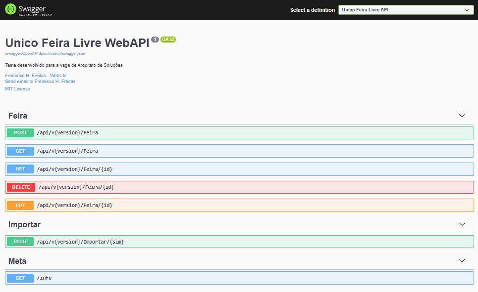

Unico Feira Feira API
=================================

Proposta:
--------- 
Desenvolver uma API que exponha os dados disponíveis em [1]
utilizando uma abordagem orientada a recursos e que atenda
os requisitos listados abaixo.

Escopo
------
Utilizando os dados do arquivo “DEINFO_AB_FEIRASLIVRES_2014.csv”, implemente:
● cadastro de uma nova feira;
● exclusão de uma feira através de seu código de registro;
● alteração dos campos cadastrados de uma feira, exceto seu código de registro;
● busca de feiras utilizando ao menos um dos parâmetros abaixo:

    ○ distrito
    ○ regiao5
    ○ nome_feira
    ○ bairro    

Requisitos
------
● utilize git ou hg para fazer o controle de versão da solução do teste e hospede-a no Github ou Bitbucket;
● armazene os dados fornecidos pela Prefeitura de São Paulo em um banco de dados relacional que você julgar apropriado;
● a solução deve conter um script para importar os dados do arquivo “DEINFO_AB_FEIRASLIVRES_2014.csv” para o banco relacional;
● a API deve seguir os conceitos REST;
● o Content-Type das respostas da API deve ser “application/json";
● o código da solução deve conter testes e algum mecanismo documentado para gerar a informação de cobertura dos testes;
● a aplicação deve gravar logs estruturados em arquivos texto;
● a solução desta avaliação deve estar documentada em português ou inglês. Escolha um idioma em que você seja fluente;
● a documentação da solução do teste deve incluir como rodar o projeto e exemplos de requisições e suas possíveis respostas;

Recursos utilizados
---------------
[x] Web API
[x] Entityframework Core
[x] Expection handling
[x] Automapper
[x] Unit testing via NUnit
[x] Integration testing via NUnit
[x] Versioning
[x] Swagger UI
[x] Mediator Pattern
[x] CQRS Pattern
[x] Loggings - seriLog

Getting Started
---------------

1) Install Visual Studio/VS Code and Asp.net Core 3.1
    https://dotnet.microsoft.com/download/dotnet/3.1

2) Configure connection string in appsettings.json

    "ConnectionStrings": {
        "UnicoFeiraConn": "Data Source=(local)\\sqlexpress01;Initial Catalog=FeiraLivreDb;Integrated Security=True",
        "IdentityConnection": "Data Source=(local)\\sqlexpress01;Initial Catalog=FeiraLivreDb;Integrated Security=True"
      }

3) Configure the path of CSV File in appsettings.json
    "CsvFeira": { "Path": "\\Projetos\\unico\\Unico.FeiraLivre\\Unico.FeiraLivre\\Files\\FEIRAS_LIVRES\\CSV\\DEINFO_DADOS_AB_FEIRASLIVRES\\DEINFO_AB_FEIRASLIVRES_2014.csv" }

4) Configure the path of Serilog

    "Serilog": {
    "MinimumLevel": "Information",
    "WriteTo": [
      {
        "Name": "RollingFile",
        "Args": {
          "pathFormat": "D:\\Logs\\log-{Date}.log",
          "outputTemplate": "{Timestamp:yyyy-MM-dd HH:mm:ss.fff zzz} [{Level}] {Message}{NewLine}{Exception}"
        }
      }

5)  Create Database SqlServer

    ● For running migration:

        ●  Option 1: Using Package Manager Console:
            ● Open Package Manager Console, select << ProjectName >>.Persistence as Default Project
            ● Run these commands:
                PM> add-migration Initial-commit-Application -Context ApplicationDbContext -o Migrations/Application
                PM> add-migration Identity-commit -Context IdentityContext -o Migrations/Identity

                PM> update-database -Context ApplicationDbContext 
                PM> update-database -Context IdentityContext 

Health check UI
---------------
https://localhost:{port_number}/healthcheck-ui

Swagger UI
---------------
https://localhost:{port_number}/OpenAPI/index.html

